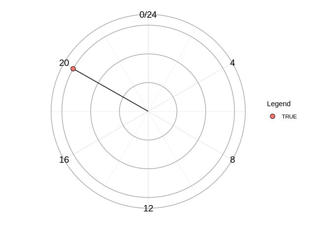
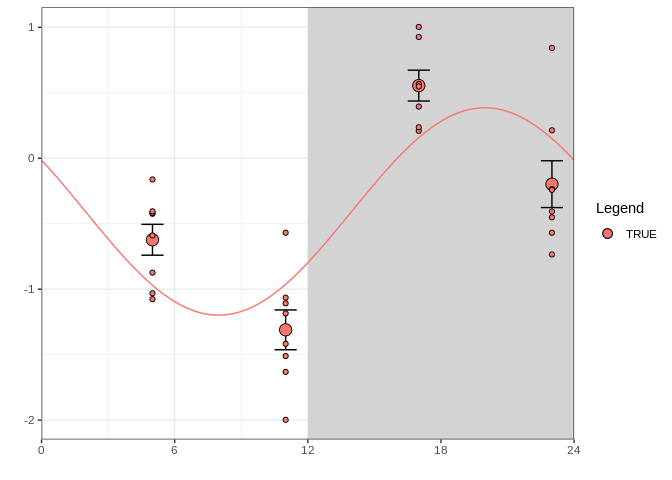
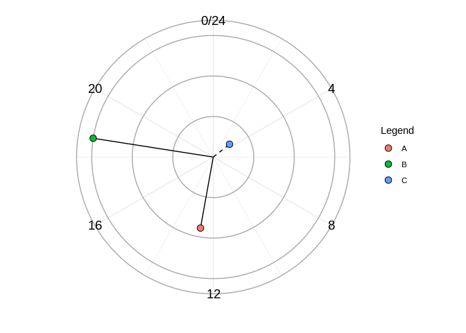
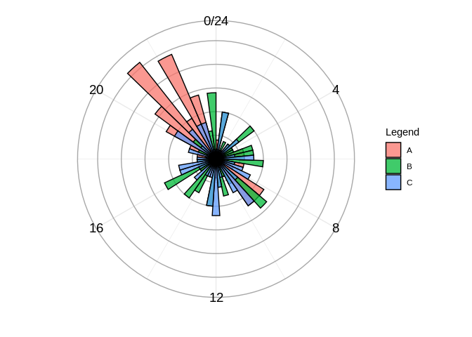

# Kronos

If you use this software, please cite our work:

``` r
citation("kronos")
```

    ## 
    ## To cite kronos in publications use:
    ## 
    ##   Bastiaanssen TFS, Leigh SJ, Tofani GSS, Gheorghe CE, Clarke G, Cryan
    ##   JF (2023) Kronos: A computational tool to facilitate biological
    ##   rhythmicity analysis. bioRxiv. doi:
    ##   https://doi.org/10.1101/2023.04.21.537503
    ## 
    ## A BibTeX entry for LaTeX users is
    ## 
    ##   @Article{,
    ##     title = {Kronos: A computational tool to facilitate biological rhythmicity analysis},
    ##     author = {Thomaz F S Bastiaanssen and Sarah-Jane Leigh and Gabriel S S Tofani and Cassandra E Gheorghe and Gerard Clarke and John F Cryan},
    ##     journal = {bioRxiv},
    ##     year = {2023},
    ##   }

The following document is adapted from the supplementary materials for
this manuscript.

## 0. Introduction

Here, we will demonstrate how to use the Kronos package to assess
circadian rhythms in biological data collected over the day. For this
demonstration we have adapted some data from our laboratory, currently
undergoing peer review (reference to come).

We will demonstrate three common examples of experimental design
currently encountered in circadian rhythms analysis:

1.  Circadian rhythm analysis of a single variable over a 24-hour period

2.  Circadian rhythm analysis of a single variable over a 24-hour period
    with two or more treatment groups

3.  Circadian rhythm analysis of omics (higher-dimensional) data over a
    24-hour period with two or more treatment groups

All R code used to transform, reorganise and plot the data is also shown
below to provide a toolkit for aspiring and veteran bioinformaticians
alike. It should be noted that some variables in the demonstration data
sets provided here have been manipulated to better demonstrate the
functionality of this package.

*At the end of this document, we have included a few excursions into
more advanced subjects we find useful, but that did not necessarily fit
in with the mainline analysis.*

### Code chunk: Install Kronos and load our libraries

``` r
#Install kronos
library(devtools)
#install_github("thomazbastiaanssen/kronos") 

#Load relevant packages
library(kronos)
library(tidyverse)
library(ggplot2)

#Load prepared data stored in Kronos library
data("kronos_demo")
```

### Code chunk: Load our data tables

Data should be prepared in “long form” for use in Kronos; that is with
values repeating in the “Timepoint” column, which defines when data was
collected during the period, here a 24-hour cycle.

Our package includes example datasets that we will use in this tutorial
that are pre-formatted. You can rearrange your data into long form using
pivot_longer() or gather() from the tidyverse.

Since we’re using prepared data, we already loaded it using
`data(kronos_demo)`. You can see how an example of how the data is
prepared below:

``` r
head(groupdata)
```

    ##   Animal_ID Timepoint Treatment Variable_1
    ## 1         6         5         A  1.2789856
    ## 2         7         5         A  1.0606877
    ## 3         8         5         A  1.0497167
    ## 4         9         5         A  1.0533610
    ## 5        10         5         A  1.4590203
    ## 6        12         5         A  0.8408964

Here we have prepared the omics data set with a separate metadata file
as is common when working with omics data sets. A metadata file can be
generated using select() in tidyr, or metadata and data can be combined
using inner_join if they contain an identical column (both name and
contents). The omics data set used here has been central-log transformed
to account for its compositional nature (see our guide
<https://arxiv.org/abs/2207.12475> for easy centred-log transformation).

## 1. Analysing Rhythmicity in a Single Group

We will start with the most simple example: analysing circadian
rhythmicity in a single experimental group for one outcome variable of
interest. For this we use the kronos function:

``` r
output <- kronos(formula = Variable_1 ~ time(Timepoint), 
                 data = onevariable, 
                 period = 24, 
                 verbose = T, 
                 pairwise = F)
```

    ## [1] "Using the following model: Variable_1 ~ Timepoint_cos + Timepoint_sin"
    ## [1] "Using the following model: Variable_1 ~ (Timepoint_cos + Timepoint_sin)"

Here we use the formula `Outcome Variable ~ time(Time Variable)`, which
is the most simple model used by the kronos function. We specify the
period as 24 (this can be adjusted as appropriate for the data
analysed). By selecting `verbose=T`, you will be able to see the models
run by the kronos function: this becomes increasingly useful when you
run more complex models. Finally we select `pairwise=F` here, as there
are no groups to compare for differences in rhythms.

The kronos function returns a kronosOut object, containing several
pieces of data that can be accessed using handy ‘getter’ functions,
which we will describe below:

1). The *getKronos_input()* function fetches the data that the model is
based on, as well as the calculated cosine and sine components.

``` r
head(getKronos_input(output))
```

    ##   Variable_1 Timepoint unique_group Timepoint_cos Timepoint_sin
    ## 1 -0.4239923         5         TRUE      0.258819     0.9659258
    ## 2 -1.0311723         5         TRUE      0.258819     0.9659258
    ## 3 -0.8739002         5         TRUE      0.258819     0.9659258
    ## 4 -0.5896825         5         TRUE      0.258819     0.9659258
    ## 5 -0.4174538         5         TRUE      0.258819     0.9659258
    ## 6 -0.4052512         5         TRUE      0.258819     0.9659258

2). The *getKronos_fit()* function fetches the key details for the
generated model that may be useful for prediction, modelling and other
statistical applications.

``` r
getKronos_fit(output)
```

    ## 
    ## Call:
    ## lm(formula = formula, data = data)
    ## 
    ## Coefficients:
    ##   (Intercept)  Timepoint_cos  Timepoint_sin  
    ##       -0.4063         0.3914        -0.6886

3). The *getKronos_trace()* function returns all the data required for
graphing the sinusoid curve, which can either be used in our specialized
ggplot2 functions, or can be used in other graphing packages. The
*y_hat* column represents the predicted value of the outcome variable:
this is essential for plotting the predicted sinusoid curve.

``` r
head(getKronos_trace(output))
```

    ##   Timepoint Timepoint_cos Timepoint_sin       y_hat unique_group
    ## 1      0.00     1.0000000    0.00000000 -0.01493121         TRUE
    ## 2      0.25     0.9978589    0.06540313 -0.06080489         TRUE
    ## 3      0.50     0.9914449    0.13052619 -0.10815799         TRUE
    ## 4      0.75     0.9807853    0.19509032 -0.15678776         TRUE
    ## 5      1.00     0.9659258    0.25881905 -0.20648595         TRUE
    ## 6      1.25     0.9469301    0.32143947 -0.25703975         TRUE

4). The *getKronos_groupwise()* function arguably fetches the most
useful output: this provides us with the p-value (p.val) and proportion
of the variance in the data explained (r.sq) when we fit our sinusoid
curve. Additionally we obtain the acrophase (acro) and amplitude of the
predicted curve, which can be used in our graphics functions to
visualise changes in curve with interventions (see `gg_kronos_circle`,
explored further below).

``` r
getKronos_groupwise(output)
```

    ##   unique_group        p.val      r.sq        avg     acro amplitude
    ## 1         TRUE 2.237134e-05 0.5345906 -0.4022588 19.97413  0.792033

### Figures

The package contains custom ggplot2 figure functions, that utilise the
kronos output to rapidly produce figures that convey important
information for circadian rhythms:

1.  `gg_kronos_circle()` generates a plot showing the acrophase and
    amplitude of the predicted curve, allowing the reader to rapidly
    access summary data regarding variables of interest, and to compare
    the summary data between groups in more complex models.At baseline,
    non-significant outcome measures are presented using dashed lines.
2.  `gg_kronos_sinusoid()` generates a x-y plot showing the outcome
    variable across the defined period. These graphs are useful for
    visualising the differences between specific timepoints assessed.

``` r
gg_kronos_circle(output)
```

<!-- -->

``` r
gg_kronos_sinusoid(output)
```

<!-- -->

## 2. Comparing Rhythmicity for More than Two Groups

Next we will demonstrate one of the unique features of the Kronos
package: the ability to compare circadian rhythms between more than two
groups. This is increasingly important as the use of complex
experimental designs grows in biological science. This example comprises
of three independent groups and is similar in setup to a one-way ANOVA.
For examples of more complex designs, see Excursion 1.

``` r
output2 <- kronos(formula = Variable_1 ~ Treatment + time(Timepoint), 
                  data = groupdata, 
                  period = 24, 
                  verbose = T, 
                  pairwise = T)
```

    ## [1] "Using the following model: Variable_1 ~ Treatment + Timepoint_cos + Timepoint_sin + Treatment:Timepoint_cos +     Treatment:Timepoint_sin - 1"
    ## [1] "Using the following model: Variable_1 ~ (Timepoint_cos + Timepoint_sin)"
    ## [1] "Using the following model: Variable_1 ~ (Timepoint_cos + Timepoint_sin)"
    ## [1] "Using the following model: Variable_1 ~ (Timepoint_cos + Timepoint_sin)"
    ## [1] "Fitting pairwise models"
    ## [1] "Using the following model: Variable_1 ~ unique_group * (Timepoint_cos + Timepoint_sin)"
    ## [1] "Using the following model: Variable_1 ~ unique_group * (Timepoint_cos + Timepoint_sin)"
    ## [1] "Using the following model: Variable_1 ~ unique_group * (Timepoint_cos + Timepoint_sin)"

``` r
gg_kronos_circle(output2)
```

<!-- -->

``` r
gg_kronos_sinusoid(output2)
```

<!-- -->

There are a few changes to the output generated by the kronos function:

1.  The *getKronos_groupwise()* output now contains a line for each of
    our groups.

``` r
getKronos_groupwise(output2)
```

    ##   unique_group       p.val       r.sq      avg      acro  amplitude
    ## 1            A 0.031490079 0.21886392 1.099699 12.681641 0.17966767
    ## 2            B 0.002912094 0.33147505 1.246347 18.592663 0.30283851
    ## 3            C 0.723230482 0.02287902 1.337834  3.447684 0.05150576

In this example you can see that groups A and B exhibit statistically
significant rhythms, while the model fitted to group C is
non-significant.

2.  We can now generate *pairwise models* output using `pairwise=T`.
    This generates pairwise comparisons between each of the groups:

``` r
getKronos_pairwise(output2)
```

    ## $`A vs B`
    ## Analysis of Variance Table
    ## 
    ## Response: Variable_1
    ##                            Df Sum Sq Mean Sq F value  Pr(>F)   
    ## unique_group                1 0.3626 0.36262  4.3279 0.04200 * 
    ## Timepoint_cos               1 0.1323 0.13228  1.5788 0.21406   
    ## Timepoint_sin               1 0.8859 0.88585 10.5728 0.00193 **
    ## unique_group:Timepoint_cos  1 0.4090 0.40901  4.8816 0.03118 * 
    ## unique_group:Timepoint_sin  1 0.5492 0.54916  6.5543 0.01314 * 
    ## Residuals                  57 4.7758 0.08379                   
    ## ---
    ## Signif. codes:  0 '***' 0.001 '**' 0.01 '*' 0.05 '.' 0.1 ' ' 1
    ## 
    ## $`A vs C`
    ## Analysis of Variance Table
    ## 
    ## Response: Variable_1
    ##                            Df Sum Sq Mean Sq F value    Pr(>F)    
    ## unique_group                1 0.9067 0.90674 14.3827 0.0003677 ***
    ## Timepoint_cos               1 0.1669 0.16692  2.6476 0.1093177    
    ## Timepoint_sin               1 0.0007 0.00068  0.0108 0.9174232    
    ## unique_group:Timepoint_cos  1 0.3425 0.34246  5.4321 0.0233965 *  
    ## unique_group:Timepoint_sin  1 0.0390 0.03899  0.6185 0.4349195    
    ## Residuals                  56 3.5305 0.06304                      
    ## ---
    ## Signif. codes:  0 '***' 0.001 '**' 0.01 '*' 0.05 '.' 0.1 ' ' 1
    ## 
    ## $`B vs C`
    ## Analysis of Variance Table
    ## 
    ## Response: Variable_1
    ##                            Df Sum Sq Mean Sq F value  Pr(>F)   
    ## unique_group                1 0.1279 0.12786  1.5595 0.21685   
    ## Timepoint_cos               1 0.0487 0.04868  0.5937 0.44417   
    ## Timepoint_sin               1 0.5623 0.56230  6.8581 0.01129 * 
    ## unique_group:Timepoint_cos  1 0.0025 0.00251  0.0306 0.86179   
    ## unique_group:Timepoint_sin  1 0.8940 0.89402 10.9038 0.00166 **
    ## Residuals                  57 4.6735 0.08199                   
    ## ---
    ## Signif. codes:  0 '***' 0.001 '**' 0.01 '*' 0.05 '.' 0.1 ' ' 1

Above we can see that overall group A is significantly different between
B and C, and that group B exhibits a significantly different rhythm from
A and C.

3.  When including independent variables, kronos will also calculate an
    overall interaction with time which can be accessed using the code
    below:

``` r
getKronos_pairwise_p(output2)
```

    ##             adj.p.val
    ## Treatment 0.004532107

This is calculated by performing a Bonferroni correction on the
interactions between both the sine and cosine time components and the
independent variable. The p-value reported is the lowest following
correction.

## 3. ’Omics Analysis

Now we will demonstrate how to adapt the kronos package for ’omics
analysis, where there are many outcome variables. We have written the
`fw_kronos` (feature-wise) function specifically for this purpose. This
function behaves very similar to the main kronos function.

It requires two core types of data: First, a table of data with rows as
features and columns as samples as input. Make sure that the feature
labels are row names rather than a column. Second, a metadata table with
rows as samples and metadata entries as columns. Suitable input data
looks like this:

``` r
#plot a little of how a big omics data should be formatted
head(bigdata, n = c(5, 5))
```

    ##                   X49        X51        X52        X24        X25
    ## Variable_1  0.6997887  0.7510796  0.4496661  0.7070641  0.7314069
    ## Variable_2  0.9185654  0.3832566  0.5772013  0.2469332  1.1264888
    ## Variable_3  5.7376737  5.7759893  5.8397621  4.6582202  4.6705684
    ## Variable_4 -0.3160217  0.2157887  5.9146992  0.1599933  0.2605589
    ## Variable_5 -4.8665730 -4.5445920 -3.5170020 -4.6925208 -4.3942593

``` r
#plot a little of the metadata should be formatted
head(bigmeta)
```

    ##   Animal_ID Group Timepoint
    ## 1       X49     B         5
    ## 2       X51     B         5
    ## 3       X52     B         5
    ## 4       X24     B         5
    ## 5       X25     B         5
    ## 6       X26     B         5

From the user’s perspective, `fw_kronos` reads very similar to the main
`kronos` function. The core difference is that `fw_kronos` accepts data
and metadata as separate objects. Furthermore, `fw_kronos` doesn’t need
a term on the left-hand side of the formula. It will automatically,
sequentially apply the given formula with each feature in the input
table as the response variable.

``` r
out_list = fw_kronos(x = bigdata, 
                     formula = ~ Group + time(Timepoint), 
                     metadata = bigmeta, 
                     period = 24,
                     verbose = F,
                     pairwise = T) 
```

Now we have a list of kronosOut objects, which contain all our results.
This can be cumbersome to do manually, so we wrote the
`kronosListToTable` function for this purpose:

``` r
fit_df = kronosListToTable(out_list)

write.csv(fit_df, "README_files/RhythmicityResults.csv")
```

This will generate a csv containing the individual rhythmicity
calculations for the whole data set with an FDR correction to account
for multiple tests.

The resulting csv can be found
[here](https://github.com/thomazbastiaanssen/kronos/blob/main/README_files/RhythmicityResults.csv).

``` r
#plot a little of fit_df
head(fit_df, n = c(5, 5))
```

    ##                 B_p.val     A_p.val   C_p.val      B_r.sq     A_r.sq
    ## Variable_1 9.532798e-01 0.030901063 0.7771550 0.003294345 0.21991674
    ## Variable_2 9.297825e-01 0.002684955 0.3122346 0.005008424 0.34483205
    ## Variable_3 2.784019e-07 0.755935357 0.4488660 0.646891288 0.01978728
    ## Variable_4 8.603783e-01 0.009861269 0.4818005 0.010317651 0.28103213
    ## Variable_5 7.528003e-01 0.012385930 0.9204081 0.019392619 0.26923016

We can use a similar approach to obtain other components of the
kronosOut objects. Below we include the code to obtain the pairwise
comparisons as a single csv, as this is slightly more difficult.

``` r
#Create an empty container list of the appropriate length
pairwise_list = vector(mode = "list", length = length(out_list)) 

#The for-loop below generates a list containing the pairwise test results
for(m in 1:length(out_list)){
  pairwise_list[[m]] <- out_list[[m]]@pairwise_models
  names(pairwise_list)[m] <- names(out_list)[m]
  
}

#Generate a single bound list
bound_list <- lapply(X = pairwise_list, FUN = function(x){do.call(rbind, x)})

#collapse the bound list for each variable into a single dataframe 
pairwise_df <- do.call(rbind, bound_list)

#separate the comparison and the effects to make results more readable
pairwise_csv = pairwise_df %>% 
  rownames_to_column("ID") %>%
  separate(col = ID, into = c("Feature","ID"), sep = "\\.", extra = "merge") %>%
  separate(col = ID, into = c("Comparison","Effect"), sep = "\\.")
  

write.csv(pairwise_csv, "README_files/PairwiseResults.csv") 
```

The resulting csv can be found
[here](https://github.com/thomazbastiaanssen/kronos/blob/main/README_files/PairwiseResults.csv).

### Figures

`gg_kronos_acrogram()` is a visualisation function we have designed
specifically for omics datasets. This function provides a polar
histogram of your dataset’s acrophases. This allows you to compare
overall rhythmicity between groups. Below we can see that a large
proportion of the variables peak between ZT20-23 in Group A, while the
variables in Groups B and C are less synchronous.

``` r
gg_kronos_acrogram(out_list)
```

<!-- -->

We can also use automation to obtain individual plots for our omics data
set. Here we will demonstrate how to obtain sinusoid curves for each
outcome measure in the data set.

``` r
 #Create an empty container list of the appropriate length
plot_list <- vector(mode = "list", length = length(out_list))

for(q in 1:length(out_list)){
  
  #save plot into relevant position in list
  plot_list[[q]] <- gg_kronos_sinusoid(out_list[[q]]) 
  
}

#to plot & save the feature graphs to a pdf:
pdf("README_files/plots_circadian.pdf")
for (i in 1:length(plot_list)) {
  print(plot_list[[i]])
}
invisible(dev.off())
```

The resulting pdf can be found
[here](https://github.com/thomazbastiaanssen/kronos/blob/main/README_files/plots_circadian.pdf).
The same approach can be applied for obtaining individual circle
figures.

## 4. Discussion

Here we have presented standard data for the analysis of time-of-day.
Some points to consider for your data is whether you can assume a
24-hour period, and whether your data is evenly distributed over the
period. Please note that you will require a minimum of three data points
over your period to make use of these functions, and indeed any function
using sinusoid models. Currently the kronos package is not able to
estimate period; a wide range of packages are capable of determining
your period if this is necessary for your research question. Please note
that period estimation requires even more temporal resolution: some
recommend a minimum of sampling every 2 hours over a 48-hr window
(Hughes et al., 2017, doi: 10.1177/0748730417728663).

This tutorial is merely a template. Depending on your experimental
set-up, findings and experimental questions you may need to adjust your
approach. However, as complex statistical models become more frequent in
the study of circadian rhythms, functions that can incorporate more
complex design than two-group comparisons are essential for advancement
of the field.

We have provided figure generation functions as clear communication of
results is essential to producing good and useful science. Please see
below for more details for figure customisation. We hope that both
aspiring and veteran bioinformaticians and circadian rhythm biologists
will find our guide helpful.

## Excursion 1. Customising Figures

The two figure functions, `gg_kronos_circle()` and
`gg_kronos_sinusoid()`, are designed to be fully compatible with ggplot2
and therefore are fully customisable. Below is an example of how one
could customise kronos plots using ggplot2 syntax

``` r
gg_kronos_circle(output2) +
  scale_fill_manual(values = c("A" = "#169B62",
                               "B" = "#FFFFFF", 
                               "C" = "#FF883E")) +
  ggtitle("Figure title")
```

<!-- -->

We encourage users to take advantage of the extensive range of online
tutorials and add-on packages available for ggplot2.

## Excursion 2. Assessing Rhythmicity in More Complex Models

One of the key features of this package is the use of a formula input,
which allows for analysis of complex models. Below we will demonstrate
how kronos performs when assessing data with two independent variables.

``` r
data3 <- twowaydata

two.way.data.long <- data3 %>%
  pivot_longer(cols=starts_with("Variable_"), names_to = "Variables", values_to = "Value") %>%
  as.data.frame()

#collect all outcome variables
two_way_data_names <- unique(two.way.data.long$Variables) 

#Create an empty container list of the appropriate length
data.list <- vector(mode = "list", length = length(two_way_data_names)) 

for(n in 1:length(two_way_data_names)){
  data.list[[n]] <- two.way.data.long %>% filter(Variables == two_way_data_names[n])
}

two_way_out_list = lapply(X = data.list, 
                          FUN = function(y){kronos(data = y, 
                                                   Value ~ Factor_A*Factor_B + time(Timepoint), 
                                                   period = 24, pairwise = T, verbose = F)
                            }
                          )

names(two_way_out_list) <- two_way_data_names


gg_kronos_sinusoid(two_way_out_list$Variable_1)
```

<!-- -->

``` r
gg_kronos_sinusoid(two_way_out_list$Variable_2)
```

<!-- -->

``` r
gg_kronos_sinusoid(two_way_out_list$Variable_3)
```

<!-- -->

``` r
gg_kronos_sinusoid(two_way_out_list$Variable_4)
```

<!-- -->

Here we have analysed 4 outcome variables which all show different
interaction effects. Here we will go into depth examining the effects
observed in Variable 1 as an example of how to interpret kronos output
for more complex designs.

``` r
gg_kronos_sinusoid(two_way_out_list$Variable_1)
```

<!-- -->

``` r
gg_kronos_circle(two_way_out_list$Variable_1)
```

<!-- -->

1). As before, we can use the `getKronos_groupwise()` function to obtain
individual rhythmicity for each group. Here you can see that 3/4 groups
exhibit rhythmicity and that both conventional groups share a similar
acrophase (which is illustrated in the figures above as well).

``` r
getKronos_groupwise(two_way_out_list$Variable_1)
```

    ##           unique_group       p.val      r.sq      avg      acro amplitude
    ## 1   Antibiotics_Stress 0.003290904 0.2855699 4712.202 16.051311 548.95960
    ## 2  Antibiotics_Control 0.045674193 0.1575633 2340.530  3.493713 219.93545
    ## 3  Conventional_Stress 0.001783400 0.3267086 2329.867 18.079296 256.07917
    ## 4 Conventional_Control 0.075062913 0.1452404 1349.590 18.002807  91.75282

2). With the `getKronos_pairwise_p()` function we can assess the
interaction of each of our experimental factors with the time component
of the model: here you can see that both main effects and the
interaction significantly interact with the time component.

``` r
getKronos_pairwise_p(two_way_out_list$Variable_1)
```

    ##                      adj.p.val
    ## Factor_A          1.000000e+00
    ## Factor_B          3.959353e-05
    ## Factor_A:Factor_B 1.911130e-02

3). Next we can use the `getKronos_pairwise()` function to obtain the
pairwise group comparisons. This allows us to determine how each group
differs from one another. For example, here you can see that
Conventional+Stress and Antibiotics+Control only exhibit a significant
group\*Timepoint_sin interaction. This is unsurprising as the groups
have the same average value but exhibit a rhythm shifted by 12 hours.

``` r
getKronos_pairwise(two_way_out_list$Variable_1)
```

    ## $`Antibiotics_Stress vs Antibiotics_Control`
    ## Analysis of Variance Table
    ## 
    ## Response: Value
    ##                            Df    Sum Sq   Mean Sq  F value    Pr(>F)    
    ## unique_group                1 107088781 107088781 392.5199 < 2.2e-16 ***
    ## Timepoint_cos               1    174790    174790   0.6407 0.4261766    
    ## Timepoint_sin               1    486557    486557   1.7834 0.1860572    
    ## unique_group:Timepoint_cos  1   1596022   1596022   5.8500 0.0181806 *  
    ## unique_group:Timepoint_sin  1   4198056   4198056  15.3874 0.0002021 ***
    ## Residuals                  70  19097668    272824                       
    ## ---
    ## Signif. codes:  0 '***' 0.001 '**' 0.01 '*' 0.05 '.' 0.1 ' ' 1
    ## 
    ## $`Antibiotics_Stress vs Conventional_Stress`
    ## Analysis of Variance Table
    ## 
    ## Response: Value
    ##                            Df    Sum Sq   Mean Sq  F value    Pr(>F)    
    ## unique_group                1 102318455 102318455 420.7923 < 2.2e-16 ***
    ## Timepoint_cos               1    741756    741756   3.0505   0.08536 .  
    ## Timepoint_sin               1   4761304   4761304  19.5812 3.697e-05 ***
    ## unique_group:Timepoint_cos  1    672717    672717   2.7666   0.10099    
    ## unique_group:Timepoint_sin  1    452020    452020   1.8590   0.17738    
    ## Residuals                  66  16048341    243157                       
    ## ---
    ## Signif. codes:  0 '***' 0.001 '**' 0.01 '*' 0.05 '.' 0.1 ' ' 1
    ## 
    ## $`Antibiotics_Stress vs Conventional_Control`
    ## Analysis of Variance Table
    ## 
    ## Response: Value
    ##                            Df    Sum Sq   Mean Sq  F value    Pr(>F)    
    ## unique_group                1 210361830 210361830 969.9952 < 2.2e-16 ***
    ## Timepoint_cos               1    726171    726171   3.3484 0.0717181 .  
    ## Timepoint_sin               1   2785092   2785092  12.8423 0.0006375 ***
    ## unique_group:Timepoint_cos  1    669456    669456   3.0869 0.0834930 .  
    ## unique_group:Timepoint_sin  1   1403802   1403802   6.4730 0.0132640 *  
    ## Residuals                  67  14530220    216869                       
    ## ---
    ## Signif. codes:  0 '***' 0.001 '**' 0.01 '*' 0.05 '.' 0.1 ' ' 1
    ## 
    ## $`Antibiotics_Control vs Conventional_Stress`
    ## Analysis of Variance Table
    ## 
    ## Response: Value
    ##                            Df  Sum Sq Mean Sq F value    Pr(>F)    
    ## unique_group                1    1922    1922  0.0163 0.8988585    
    ## Timepoint_cos               1  168888  168888  1.4301 0.2358990    
    ## Timepoint_sin               1   18570   18570  0.1572 0.6929452    
    ## unique_group:Timepoint_cos  1  209481  209481  1.7739 0.1873534    
    ## unique_group:Timepoint_sin  1 1847703 1847703 15.6460 0.0001847 ***
    ## Residuals                  68 8030383  118094                      
    ## ---
    ## Signif. codes:  0 '***' 0.001 '**' 0.01 '*' 0.05 '.' 0.1 ' ' 1
    ## 
    ## $`Antibiotics_Control vs Conventional_Control`
    ## Analysis of Variance Table
    ## 
    ## Response: Value
    ##                            Df   Sum Sq  Mean Sq  F value    Pr(>F)    
    ## unique_group                1 19495877 19495877 206.5666 < 2.2e-16 ***
    ## Timepoint_cos               1   175177   175177   1.8561  0.177510    
    ## Timepoint_sin               1   101312   101312   1.0734  0.303786    
    ## unique_group:Timepoint_cos  1   195432   195432   2.0707  0.154676    
    ## unique_group:Timepoint_sin  1   729445   729445   7.7288  0.006999 ** 
    ## Residuals                  69  6512262    94381                       
    ## ---
    ## Signif. codes:  0 '***' 0.001 '**' 0.01 '*' 0.05 '.' 0.1 ' ' 1
    ## 
    ## $`Conventional_Stress vs Conventional_Control`
    ## Analysis of Variance Table
    ## 
    ## Response: Value
    ##                            Df   Sum Sq  Mean Sq  F value    Pr(>F)    
    ## unique_group                1 18114110 18114110 340.0055 < 2.2e-16 ***
    ## Timepoint_cos               1     1535     1535   0.0288   0.86575    
    ## Timepoint_sin               1  1116016  1116016  20.9479 2.184e-05 ***
    ## unique_group:Timepoint_cos  1      132      132   0.0025   0.96050    
    ## unique_group:Timepoint_sin  1   256055   256055   4.8062   0.03194 *  
    ## Residuals                  65  3462935    53276                       
    ## ---
    ## Signif. codes:  0 '***' 0.001 '**' 0.01 '*' 0.05 '.' 0.1 ' ' 1

## Session Info

``` r
sessioninfo::session_info()
```

    ## ─ Session info ───────────────────────────────────────────────────────────────
    ##  setting  value
    ##  version  R version 4.1.2 (2021-11-01)
    ##  os       Ubuntu 20.04.3 LTS
    ##  system   x86_64, linux-gnu
    ##  ui       X11
    ##  language en_GB:en
    ##  collate  en_GB.UTF-8
    ##  ctype    en_GB.UTF-8
    ##  tz       Europe/Dublin
    ##  date     2023-04-24
    ##  pandoc   2.19.2 @ /usr/lib/rstudio/bin/quarto/bin/tools/ (via rmarkdown)
    ## 
    ## ─ Packages ───────────────────────────────────────────────────────────────────
    ##  package     * version date (UTC) lib source
    ##  assertthat    0.2.1   2019-03-21 [1] CRAN (R 4.1.2)
    ##  backports     1.4.1   2021-12-13 [1] CRAN (R 4.1.2)
    ##  brio          1.1.3   2021-11-30 [1] CRAN (R 4.1.2)
    ##  broom         0.8.0   2022-04-13 [1] CRAN (R 4.1.2)
    ##  cachem        1.0.6   2021-08-19 [1] CRAN (R 4.1.2)
    ##  callr         3.7.0   2021-04-20 [1] CRAN (R 4.1.2)
    ##  cellranger    1.1.0   2016-07-27 [1] CRAN (R 4.1.2)
    ##  cli           3.3.0   2022-04-25 [1] CRAN (R 4.1.2)
    ##  colorspace    2.0-3   2022-02-21 [1] CRAN (R 4.1.2)
    ##  crayon        1.5.1   2022-03-26 [1] CRAN (R 4.1.2)
    ##  DBI           1.1.2   2021-12-20 [1] CRAN (R 4.1.2)
    ##  dbplyr        2.2.0   2022-06-05 [1] CRAN (R 4.1.2)
    ##  desc          1.4.1   2022-03-06 [1] CRAN (R 4.1.2)
    ##  devtools    * 2.4.3   2021-11-30 [1] CRAN (R 4.1.2)
    ##  digest        0.6.29  2021-12-01 [1] CRAN (R 4.1.2)
    ##  dplyr       * 1.0.9   2022-04-28 [1] CRAN (R 4.1.2)
    ##  ellipsis      0.3.2   2021-04-29 [1] CRAN (R 4.1.2)
    ##  evaluate      0.15    2022-02-18 [1] CRAN (R 4.1.2)
    ##  fansi         1.0.3   2022-03-24 [1] CRAN (R 4.1.2)
    ##  farver        2.1.1   2022-07-06 [1] CRAN (R 4.1.2)
    ##  fastmap       1.1.0   2021-01-25 [1] CRAN (R 4.1.2)
    ##  forcats     * 0.5.1   2021-01-27 [1] CRAN (R 4.1.2)
    ##  fs            1.5.2   2021-12-08 [1] CRAN (R 4.1.2)
    ##  generics      0.1.2   2022-01-31 [1] CRAN (R 4.1.2)
    ##  ggplot2     * 3.3.6   2022-05-03 [1] CRAN (R 4.1.2)
    ##  glue          1.6.2   2022-02-24 [1] CRAN (R 4.1.2)
    ##  gtable        0.3.0   2019-03-25 [1] CRAN (R 4.1.2)
    ##  haven         2.5.0   2022-04-15 [1] CRAN (R 4.1.2)
    ##  highr         0.9     2021-04-16 [1] CRAN (R 4.1.2)
    ##  hms           1.1.1   2021-09-26 [1] CRAN (R 4.1.2)
    ##  htmltools     0.5.2   2021-08-25 [1] CRAN (R 4.1.2)
    ##  httr          1.4.3   2022-05-04 [1] CRAN (R 4.1.2)
    ##  jsonlite      1.8.0   2022-02-22 [1] CRAN (R 4.1.2)
    ##  knitr         1.39    2022-04-26 [1] CRAN (R 4.1.2)
    ##  kronos      * 0.1.0.0 2023-04-24 [1] Github (thomazbastiaanssen/kronos@2208d0a)
    ##  labeling      0.4.2   2020-10-20 [1] CRAN (R 4.1.2)
    ##  lifecycle     1.0.1   2021-09-24 [1] CRAN (R 4.1.2)
    ##  lubridate     1.8.0   2021-10-07 [1] CRAN (R 4.1.2)
    ##  magrittr      2.0.3   2022-03-30 [1] CRAN (R 4.1.2)
    ##  memoise       2.0.1   2021-11-26 [1] CRAN (R 4.1.2)
    ##  modelr        0.1.8   2020-05-19 [1] CRAN (R 4.1.2)
    ##  munsell       0.5.0   2018-06-12 [1] CRAN (R 4.1.2)
    ##  pillar        1.7.0   2022-02-01 [1] CRAN (R 4.1.2)
    ##  pkgbuild      1.3.1   2021-12-20 [1] CRAN (R 4.1.2)
    ##  pkgconfig     2.0.3   2019-09-22 [1] CRAN (R 4.1.2)
    ##  pkgload       1.2.4   2021-11-30 [1] CRAN (R 4.1.2)
    ##  prettyunits   1.1.1   2020-01-24 [1] CRAN (R 4.1.2)
    ##  processx      3.6.0   2022-06-10 [1] CRAN (R 4.1.2)
    ##  ps            1.7.0   2022-04-23 [1] CRAN (R 4.1.2)
    ##  purrr       * 0.3.4   2020-04-17 [1] CRAN (R 4.1.2)
    ##  R6            2.5.1   2021-08-19 [1] CRAN (R 4.1.2)
    ##  readr       * 2.1.2   2022-01-30 [1] CRAN (R 4.1.2)
    ##  readxl        1.4.0   2022-03-28 [1] CRAN (R 4.1.2)
    ##  remotes       2.4.2   2021-11-30 [1] CRAN (R 4.1.2)
    ##  reprex        2.0.1   2021-08-05 [1] CRAN (R 4.1.2)
    ##  rlang         1.1.0   2023-03-14 [1] CRAN (R 4.1.2)
    ##  rmarkdown     2.14    2022-04-25 [1] CRAN (R 4.1.2)
    ##  rprojroot     2.0.3   2022-04-02 [1] CRAN (R 4.1.2)
    ##  rstudioapi    0.13    2020-11-12 [1] CRAN (R 4.1.2)
    ##  rvest         1.0.2   2021-10-16 [1] CRAN (R 4.1.2)
    ##  scales        1.2.0   2022-04-13 [1] CRAN (R 4.1.2)
    ##  sessioninfo   1.2.2   2021-12-06 [1] CRAN (R 4.1.2)
    ##  stringi       1.7.6   2021-11-29 [1] CRAN (R 4.1.2)
    ##  stringr     * 1.4.0   2019-02-10 [1] CRAN (R 4.1.2)
    ##  testthat      3.1.4   2022-04-26 [1] CRAN (R 4.1.2)
    ##  tibble      * 3.1.7   2022-05-03 [1] CRAN (R 4.1.2)
    ##  tidyr       * 1.2.0   2022-02-01 [1] CRAN (R 4.1.2)
    ##  tidyselect    1.1.2   2022-02-21 [1] CRAN (R 4.1.2)
    ##  tidyverse   * 1.3.1   2021-04-15 [1] CRAN (R 4.1.2)
    ##  tzdb          0.3.0   2022-03-28 [1] CRAN (R 4.1.2)
    ##  usethis     * 2.1.5   2021-12-09 [1] CRAN (R 4.1.2)
    ##  utf8          1.2.2   2021-07-24 [1] CRAN (R 4.1.2)
    ##  vctrs         0.4.1   2022-04-13 [1] CRAN (R 4.1.2)
    ##  withr         2.5.0   2022-03-03 [1] CRAN (R 4.1.2)
    ##  xfun          0.31    2022-05-10 [1] CRAN (R 4.1.2)
    ##  xml2          1.3.3   2021-11-30 [1] CRAN (R 4.1.2)
    ##  yaml          2.3.5   2022-02-21 [1] CRAN (R 4.1.2)
    ## 
    ##  [1] /home/thomaz/R/x86_64-pc-linux-gnu-library/4.1
    ##  [2] /usr/local/lib/R/site-library
    ##  [3] /usr/lib/R/site-library
    ##  [4] /usr/lib/R/library
    ## 
    ## ──────────────────────────────────────────────────────────────────────────────
